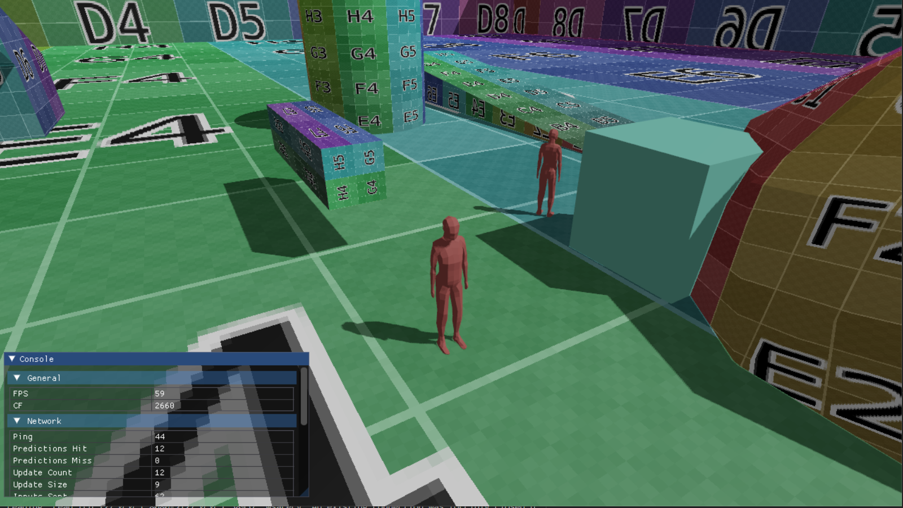

# kito
kito is a 3D game engine written in go using SDL2 and OpenGL (mostly OpenGL). I've been using this as a test bed for developing popular game engine components.

## Current Work
Here are a couple of things I've built for kito:
1. An Entity, Component, System architecture
2. An animation system that supports collada models
3. A rendering system using OpenGL
4. Support for shaders
5. A shadow mapping implementation

## Future Work
1. Multiplayer support with entity interpolation, client side prediction, server reconciliation
2. Further improvements to shadowmapping for improved shadow fidelity

# Development Setup

Install SDL2 following the instructions at https://github.com/veandco/go-sdl2

# Running kito
> go run main.go

