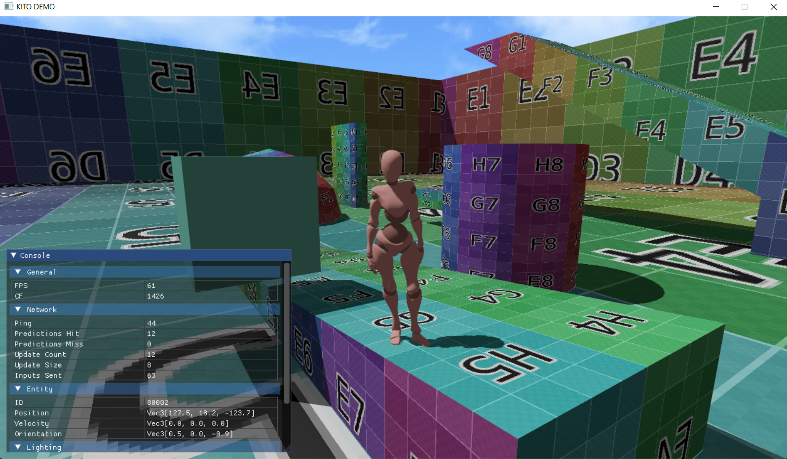

# kito
kito is a 3D game engine written with Go/SDL2/OpenGl. Current development has been focused on experimenting with game architectures and rendering

## Current Features
Here are a couple of things I've built for kito:
1. Entity, Component, System architecture
1. Rendering GLTF assets (geometry, skinning, animations)
1. Physically Based Rendering (PBR) support
1. Shadow mapping
1. Multiplayer support with client-side prediction, rollback correction, state interpolation

# Development Setup

Install SDL2 following the instructions at https://github.com/veandco/go-sdl2

# Running the demo project 
```
# running the server:
make server
# running the client:
make
```


